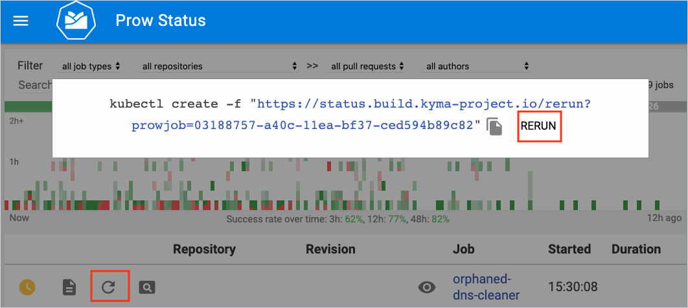

# Prow jobs

This document provides an overview of Prow jobs.  

## Directory structure

Prow jobs reside in the `prow/jobs` directory in the `tanzu-test-infra` repository. Job definitions are configured in YAML files. Prow jobs can be connected to specific components or be more general, like for integration jobs. General jobs are defined directly under the `jobs/{repository_name}` directories. Jobs configured for components are available in `jobs/{repository_name}`directories which include subdirectories representing each component and containing job definitions.


This is a sample directory structure:

```
...
prow
|- cluster
| |- prow apps and ingress
|- images
|- jobs
| |- tanzu-test-infra
| |- carvel
| |- community-edition
| | |- components
| | | |- environments
| | | | |- environments.yaml
| | |- integration.yaml
| |- pinniped
|- scripts
|- config.yaml
|- plugins.yaml
...
```
> **NOTE:** All YAML files in the whole `jobs` structure need to have unique names.


## Job types

You can configure the following job types:

- **Presubmit** jobs run on pull requests (PRs). They validate changes against the target repository. By default, all presubmit jobs must pass before you can merge the PR.  If you set the **optional** parameter to `true`, a job becomes optional and you can still merge your PR even if the job fails.
- **Postsubmit** jobs are almost the same as the already defined presubmit jobs, but they run when you merge the PR. You can notice the difference in labels as postsubmit jobs use **preset-build-main** instead of **preset-build-pr**.
- **Periodic** jobs run automatically at a scheduled time. You don't need to modify or merge the PR to trigger them.

The presubmit and postsubmit jobs for a PR run in a random order. Their number in a PR depends on the configuration in the YAML file. You can check the job status on [`https://status.build.vmware-tanzu-project.io/`](https://status.build.vmware-tanzu-project.io/).


## Naming convention

When you define jobs for Prow, the **name** parameter of the job must follow one of these patterns:

- `{prefix}-{repository-name}-{path-to-component}` for components
- `{prefix}-{repository-name}` for jobs not connected to a particular component

You can extend the name of the job with a suffix to indicate the job's purpose. For example, write `pre-main-vmware-tanzu-integration`.

Add `{prefix}` in front of all presubmit and postsubmit jobs. Use:
- `pre-main` for presubmit jobs that run against the `main` branch.
- `post-main` for postsubmit jobs that run against the `main` branch.
- `pre-rel{release-number}` for presubmit jobs that run against the release branches. For example, write `pre-rel06-vmware-tanzu-components-api-controller`.


## Triggers

Prow runs presubmit and postsubmit jobs based on the following parameters:

- `always_run: true` for the job to run automatically at all times.
- `run_if_changed: {regular expression}` for the job to run if a PR modifies files matching the pattern. If a PR does not modify the files, this job sends a notification to GitHub with the information that the job is skipped.

**always_run** and **run_if_changed** are mutually exclusive. If you do not set one of them, you can only trigger the job manually by adding a comment to a PR.                                                               


## Interact with Prow

Prow allows you to use comments to rerun presubmit jobs on PRs.

> **NOTE:** You can rerun only presubmit jobs.

If you want to trigger your job again, add one of these comments to your PR:

`/test all` to rerun all tests
`/retest` to only rerun failed tests
`/test {test-name}` or `/retest {test-name}` to only rerun a specific test. For example, run `/test pre-main-vmware-tanzu-components-binding-usage-controller`.

After you trigger the job, it appears on [`https://status.build.vmware-tanzu-project.io/`](https://status.build.prow.tanzu.io/).


## Create jobs

Jobs are generated from templates stored in the `templates` directory. For details on how to configure templates, read [Render Templates](../../development/tools/cmd/rendertemplates/README.md). To generate jobs, run this command in the root of the repository:

```bash
make jobs-definitions
```

- For details on how to create jobs, see [Manage component jobs with templates](./manage-component-jobs-with-templates.md).
- For further reference, read a more technical insight into the Kubernetes [Prow Jobs](https://github.com/kubernetes/test-infra/blob/master/prow/jobs.md).


## Prow job tester
Prow job tester (`pjtester`) is a dedicated tool for testing changes to Prow jobs and scripts in the `test-infra` repository, which are **under development**. Additionally, it can use code from pull requests (PRs) in other repositories.

For example, to test a PR in the vmware-tanzu repository, create a new file `vpath/pjtester.yaml` in the `test-infra` repository.
```yaml
pjNames:
  - pjName: <PROW JOB NAME>
  - pjName: ...
prConfigs:
  vmware-tanzu-project:
    vmware-tanzu:
      prNumber: <PR NUMBER IN vmware-tanzu REPO>
```
| Parameter name | Required | Description |
|----------------|----------|-------------|
| **pjNames** | Yes | List containing the configuration of Prow jobs to test.
| **pjNames.pjName** | Yes | Name of the Prow job to test.
| **prConfigs** | No | Dictionary containing the numbers of the pull requests on repositories other than `test-infra`. <br> `pjtester` uses their code to test the Prow jobs.

> **NOTE:** We recommend to keep PRs as draft ones until you're satisfied with the results.

- For more details on how to use `pjtester`, see [the `pjtester` README](https://github.com/vmware-tanzu-project/test-infra/blob/main/development/tools/cmd/pjtester/README.md)
document.
- To see how to trigger Prow jobs to test, go to the aforementioned [`Interact with Prow`](./prow-jobs.md#interact-with-prow) section.


## Rerun jobs from UI
All [cluster-access](https://github.com/orgs/vmware-tanzu/teams/cluster-access) team members are authorized to rerun jobs from UI.




## Trigger jobs manually

In most situations, re-running the job means that Prow uses the same commit. To make sure the job uses the updated code base, you can trigger the job manually.
Use a tool called [mkpj](https://github.com/kubernetes/test-infra/tree/master/prow/cmd/mkpj) that generates a valid YAML for the Prow job. Follow these steps:

1. Clone the `kubernetes/test-infra` repository into the `k8s.io` directory. Run:

    ```shell
    git clone "git@github.com:kubernetes/test-infra.git" $GOPATH/src/k8s.io
    ```

2. Reset the [compatible](./production-cluster-configuration.md#overview) `kubernetes/test-infra` state:

    ```shell
    git reset <compatible commit sha> --hard
    ```
3. See the example of generating the `vmware-tanzu-gke-nightly` target:

   ```shell
   go run prow/cmd/mkpj/main.go --job=vmware-tanzu-gke-nightly --config-path="$GOPATH/src/github.com/vmware-tanzu-project/test-infra/prow/config.yaml" --job-config-path="$GOPATH/src/github.com/vmware-tanzu-project/test-infra/prow/jobs/" > job.yaml
   ```

4. You can trigger this job manually. Run:
   ```shell
   kubectl apply -f job.yaml
   ```

> **NOTE**: Do not edit the generated YAML by hand. Modify the file under the `--job-config-path` parameter, and use [mkpj](https://github.com/kubernetes/test-infra/tree/master/prow/cmd/mkpj) again.
